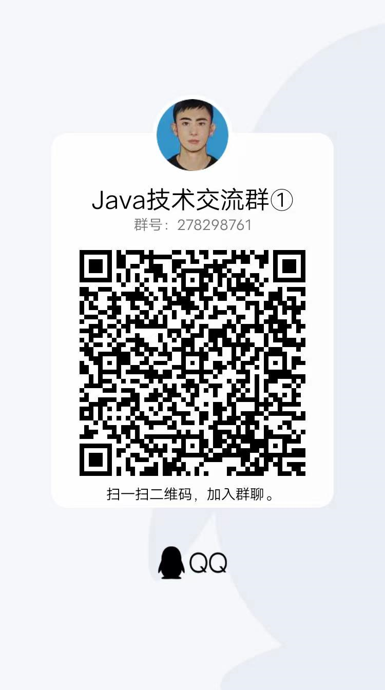

### 新一代 Spring Boot+Spring Security+Jwt 2.0来袭 ☟☟☟

新一代基于Spring Boot、Spring Security、Oauth2等实现的权限控制和认证服务、支持第三方oauth授权和获取资源信息功能等、详情请点击下面的项目地址查看，欢迎大家使用体验，觉得不错的给个star，谢谢！
项目地址：https://gitee.com/micai-code/micai-platform-auth

## RestApi接口增加JWT认证功能

用户填入用户名密码后，与数据库里存储的用户信息进行比对，如果通过，则认证成功。传统的方法是在认证通过后，创建sesstion，并给客户端返回cookie。
现在我们采用JWT来处理用户名密码的认证。区别在于，认证通过后，服务器生成一个token，将token返回给客户端，客户端以后的所有请求都需要在http头中指定该token。
服务器接收的请求后，会对token的合法性进行验证。验证的内容包括：

内容是一个正确的JWT格式
检查签名
检查claims
检查权限
处理登录
创建一个类JWTLoginFilter，核心功能是在验证用户名密码正确后，生成一个token，并将token返回给客户端：
该类继承自UsernamePasswordAuthenticationFilter，重写了其中的2个方法：
attemptAuthentication ：接收并解析用户凭证。
successfulAuthentication ：用户成功登录后，这个方法会被调用，我们在这个方法里生成token。

### 授权验证

用户一旦登录成功后，会拿到token，后续的请求都会带着这个token，服务端会验证token的合法性。
创建JwtAuthenticationFilter类，我们在这个类中实现token的校验功能。
该类继承自BasicAuthenticationFilter，在doFilterInternal方法中，从http头的Authorization 项读取token数据，然后用Jwts包提供的方法校验token的合法性。
如果校验通过，就认为这是一个取得授权的合法请求。

### SpringSecurity配置

通过SpringSecurity的配置，将上面的方法组合在一起。
这是标准的SpringSecurity配置内容，就不在详细说明。注意其中的
.addFilter(new JWTLoginFilter(authenticationManager()))
.addFilter(new JwtAuthenticationFilter(authenticationManager()))
这两行，将我们定义的JWT方法加入SpringSecurity的处理流程中。

### 简单测试

下面对我们的程序进行简单的验证： 
#### 1.请求获取用户列表接口:http://localhost:8080/users/userList接口，会收到401错误 
{
    "timestamp": 1567564486909,
    "status": 401,
    "error": "Unauthorized",
    "message": "Full authentication is required to access this resource",
    "path": "/users/userList"
}
curl http://localhost:8080/users/userList 
原因就是因为这个url没有授权,所以返回401 

#### 2.注册一个新用户 
curl -H "Content-Type: application/json" -X POST -d '{ 
    "username": "admin", 
    "password": "password" 
}' http://localhost:8080/users/signup 

#### 3.登录，会返回token，在http header中，Authorization: Bearer 后面的部分就是token 
curl -i -H "Content-Type: application/json" -X POST -d '{ 
    "username": "admin", 
    "password": "password" 
}' http://localhost:8080/login 
温馨提醒:这里的login方法是spring specurity框架提供的默认登录url

#### 4.用登录成功后拿到的token再次请求/users/userList接口 
 4.1将请求中的XXXXXX替换成拿到的token 
 4.2这次可以成功调用接口了 
curl -H "Content-Type: application/json" 
-H "Authorization: Bearer XXXXXX" 
"http://localhost:8080/users/userList"

#### 5.设置了1分钟后Token过期，如果1分钟后再次请求/users/userList接口返回Token过期的异常提示如下图: 

### 集成Swagger-ui，方便前后端分离开发，默认访问地址：http://localhost:8080/swagger-ui.html  

温馨提示：这里的登录接口还是使用的默认地址，如果你的token过期了，需要你重新登录生成新的token. 

## 微信交流群  

为了更好的交流，我们新提供了微信交流群（200人+），鉴于微信群二维码有过期时间，所以还请大家扫描下面的二维码，关注公众号（ **加完群取消关注即可** ），回复【加群】，根据提示信息，加作者微信，作者会拉你进群的，感谢配合！

## QQ群交流群  

## 更新日志

[见wiki](https://gitee.com/micai-code/springboot-springsecurity-jwt-demo/wikis/%E6%9B%B4%E6%96%B0%E6%97%A5%E5%BF%97)

